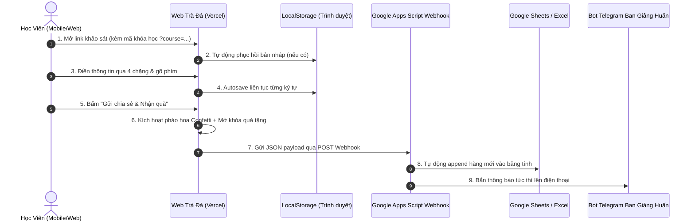

# ☕ TRÀ ĐÁ SAU GIỜ HỌC - HỆ THỐNG KHẢO SÁT & KẾT NỐI HỌC VIÊN 7-LEVEL

> *"Tan lớp cất máy gập cam, 
> Làm ly trà đá hỏi han chuyện nghề."*

Hệ thống khảo sát sau khóa học (Offline & Online) được thiết kế theo chuẩn **7 Tầng Hệ Thống (7-Level Architecture)**, tối ưu UI/UX Mobile-First conversational, tự động hứng dữ liệu về Google Sheets / Excel và bắn thông báo qua Telegram.

---

## 🌟 ĐẶC ĐIỂM NỔI BẬT

1. **Văn phong gần gũi & chân thật:** Xóa tan cảm giác làm form khô khan, mở màn bằng thơ lục bát mộc mạc và câu hỏi gợi mở thân tình.
2. **Khai thác Marketing Insight:** Biết chính xác học viên đến từ video nào (video 20s nào làm họ chốt đơn ngay?), kênh nào (TikTok, FB, YT, Threads...).
3. **Thu thập link kênh của học viên:** Để ban giảng huấn vào xem video, follow kết nối và gửi tài liệu chuyên sâu phù hợp theo ngành nghề.
4. **Lắng nghe góp ý vận hành:** Tiếp thu thẳng thắn các vấn đề (check-in, khảo sát đầu vào, chăm sóc học viên vắng, tư vấn rõ ưu đãi giảm 10% nhóm 2 người).
5. **Autosave LocalStorage (Offline-First):** Tự động lưu nháp từng ký tự, không sợ mất dữ liệu khi mất mạng hoặc lỡ tắt tab.
6. **Mở khóa quà tặng & Confetti:** Hiệu ứng pháo hoa chúc mừng và tặng ngay Kho 30+ Prompt AI kịch bản.

---

## 🔄 MÔ TẢ LUỒNG QUY TRÌNH HOẠT ĐỘNG (WORKFLOW)

---

## 📁 CẤU TRÚC THƯ MỤC DỰ ÁN

* `index.html` / `tra-da-sau-gio-hoc.html`: Giao diện web chính.
* `google_apps_script_webhook.gs`: Code Apps Script kết nối Google Sheets & Telegram.
* `Mau_Bang_Khao_Sat_Hoc_Vien_VietMac.xlsx`: Bảng tính Excel mẫu (Raw Data, Dashboard NPS, CRM).
* `setup_excel_and_sheets.py`: Python script sinh file Excel mẫu.
* `vercel.json`: Cấu hình routing cho Vercel.

---

## 🚀 CÁCH SỬ DỤNG CHO TỪNG KHÓA HỌC

Chỉ cần gửi link kèm đuôi tham số `?course=...`:
* **Offline Hà Nội:** `https://trada.vercel.app/?course=Offline_K12_HaNoi`
* **Offline Sài Gòn:** `https://trada.vercel.app/?course=Offline_K13_SaiGon`
* **Offline Hải Phòng:** `https://trada.vercel.app/?course=Offline_HaiPhong`
* **Online Masterclass:** `https://trada.vercel.app/?course=Online_Masterclass_K05`
* **AI Automation:** `https://trada.vercel.app/?course=AI_Video_K01`
